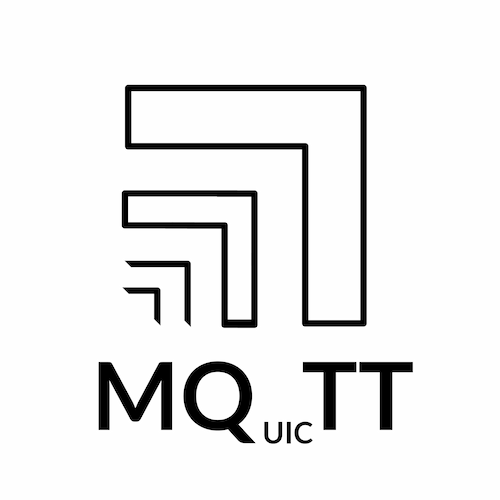

# MQuicTT

🚧 This is a pre-alpha project, tread carefully 🚧

A rustlang utility/library for MQTT over QUIC. Please open issues or PRs to help with developing this library :D

## Acknowledgements
We use [quinn-rs/quinn][quinn] underneath.

[quinn]: https://github.com/quinn-rs/quinn